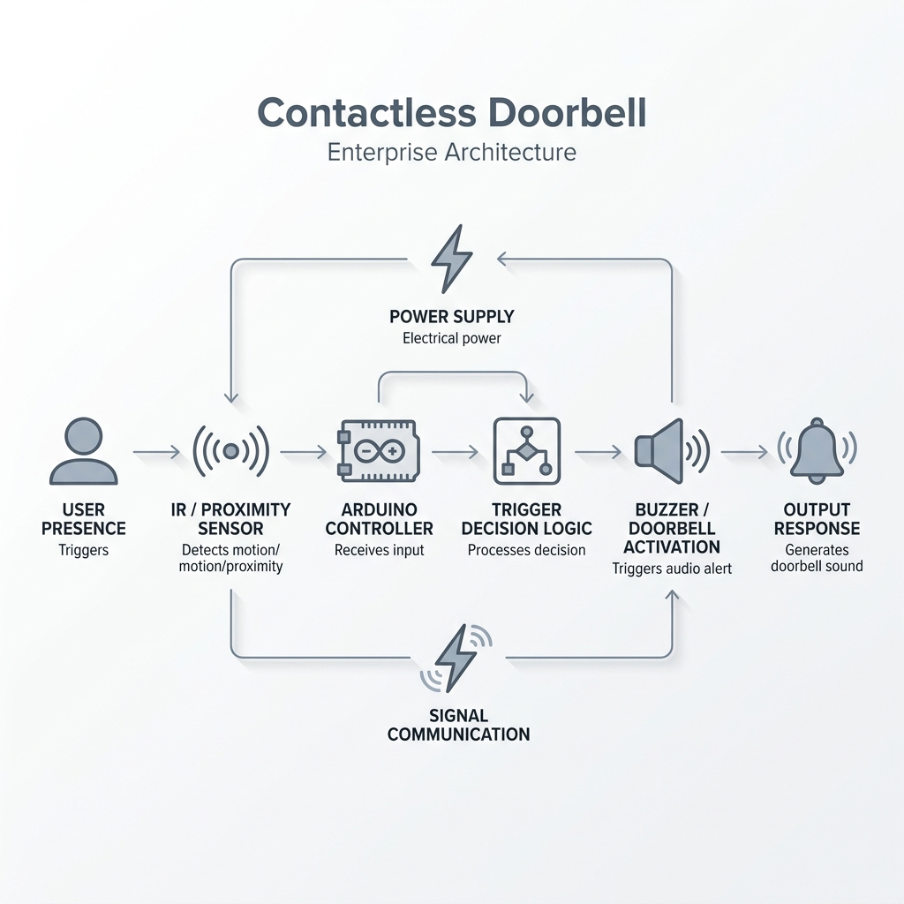
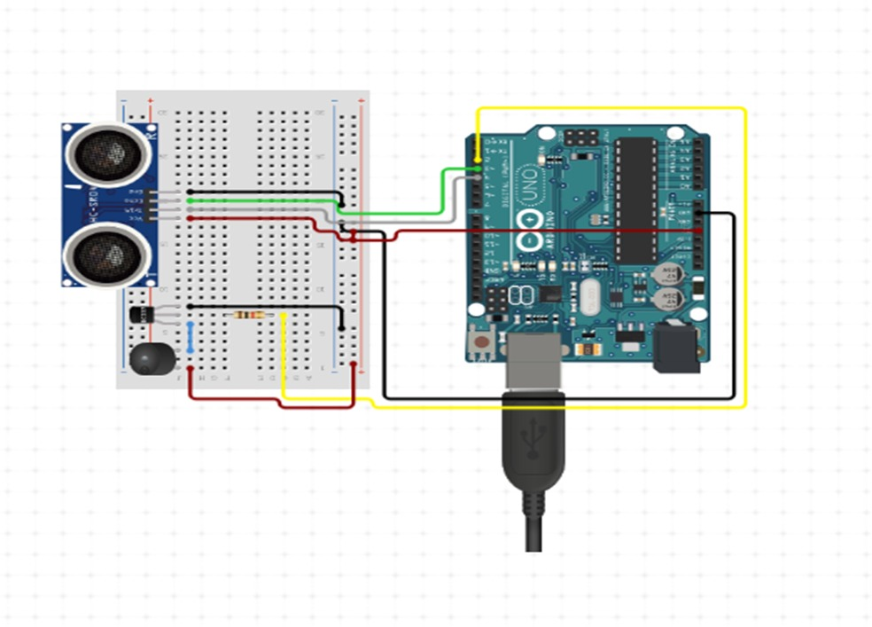

# 🚪 Smart Contactless Doorbell (IoT Automation)

[](https://www.arduino.cc/)
[](https://cplusplus.com/)
[]()

> **A touch-free, automated smart doorbell system built on Arduino. Utilizes ultrasonic proximity sensing to trigger access alerts, mitigating surface contact and improving hygiene in high-traffic environments.**

---

## 📋 Table of Contents

- [Project Overview](#-project-overview)
- [Problem Statement](#-problem-statement)
- [System Workflow](#-system-workflow)
- [Features](#-features)
- [Technology Stack](#-technology-stack)
- [Components Used](#-components-used)
- [Circuit Diagram & Execution](#-circuit-diagram--execution)
- [Folder Structure](#-folder-structure)
- [Installation & Setup](#-installation--setup)
- [Challenges Solved](#-challenges-solved)
- [Future Improvements](#-future-improvements)
- [Learning Outcomes](#-learning-outcomes)

---

## 🎯 Project Overview

This project implements a hardware-based automation system using an **Arduino Uno** to create a contactless doorbell. By continuously polling an **HC-SR04 Ultrasonic Sensor**, the system can calculate real-time distance and automatically trigger a piezo buzzer when a user approaches the door. This effectively eliminates the need for physical interaction with a button, creating a safer and more seamless entry experience.

---

## 💼 Problem Statement

Traditional doorbells require physical contact, making them critical vectors for the transmission of bacteria and viruses in public buildings, hospitals, and residential complexes. 

**The Solution:** Build a robust embedded system that automatically detects human presence within a configurable threshold and triggers an alert completely touch-free, ensuring zero physical interaction and preventing cross-contamination.

---

## 🔄 System Workflow



1. **Initialization:** The Arduino micro-controller powers on, configuring the digital pins for the ultrasonic trigger, echo reading, and buzzer output.
2. **Continuous Polling:** The system fires a 10-microsecond acoustic pulse every 500 milliseconds.
3. **Echo Measurement:** The `pulseIn()` function calculates the precise time taken for the sound wave to return.
4. **Distance Calculation:** The duration is converted into centimeters using the speed of sound ($343 m/s$).
5. **Event Trigger:** If the calculated distance falls below the $50 cm$ threshold, the system drives the Piezo Buzzer `HIGH` for exactly 2 seconds before resetting.

---

## ✨ Features

- **Contactless Bell Trigger**: Completely automated presence detection.
- **Arduino-Based Automation**: Lightweight and reliable embedded execution.
- **Configurable Range**: Easily modify the proximity threshold via a software constant.
- **Acoustic Feedback**: Clear, audible alerting using a piezo buzzer.
- **Fail-Safe Timeout Handling**: Robust `pulseIn` timeouts to prevent system hanging on missed echoes.

---

## 🛠️ Technology Stack

- **Firmware Development:** Arduino IDE
- **Language:** C++ (Embedded)
- **Micro-controller Architecture:** Atmel AVR (ATmega328P)

---

## 🧰 Components Used

| Component | Function |
|---|---|
| **Arduino Uno** | Core processor handling logic and I/O. |
| **HC-SR04 Sensor** | Ultrasonic distance measurement module. |
| **Piezo Buzzer** | Acoustic output device. |
| **Breadboard & Jumpers** | For prototyping the circuit. |
| **5V Power Source** | USB or battery power for the MCU. |

---

## 🔌 Circuit Diagram & Execution

Below is the provided schematic demonstrating the hardware wiring between the Arduino, Sensor, and Buzzer.



### Wiring Configuration:
* **Ultrasonic `Trig`** ➡️ Arduino Pin `9`
* **Ultrasonic `Echo`** ➡️ Arduino Pin `8`
* **Piezo Buzzer `+`** ➡️ Arduino Pin `12`
* **VCC & GND** ➡️ Arduino `5V` & `GND`

---

## 📁 Folder Structure

```text
Contactless-Door-bell-using-Arduino/
│
├── src/
│   └── Contactless_Doorbell/
│       └── Contactless_Doorbell.ino   # Core embedded C++ logic
│
├── assets/
│   ├── architecture.png               # System workflow architecture diagram
│   └── Circuit_Diagram.jpg            # Hardware wiring schematic
│
└── README.md                          # Project documentation
```

---

## 🚀 Installation & Setup

1. **Clone the Repository:**
   ```bash
   git clone https://github.com/Shiva-Sharan/Contactless-Door-bell-using-Arduino.git
   ```
2. **Open the Project:**
   Launch the **Arduino IDE** and open `src/Contactless_Doorbell/Contactless_Doorbell.ino`.
3. **Connect Hardware:**
   Wire the components exactly as outlined in the Circuit Diagram section. Connect the Arduino Uno to your PC via USB.
4. **Compile & Flash:**
   - Select the correct Board (`Arduino Uno`) and Port in the IDE.
   - Click **Upload**.
5. **Monitor Output:**
   Open the **Serial Monitor** (Baud rate: `9600`) to observe real-time distance measurements and system status.

---

## 🛡️ Challenges Solved

- **Signal Overlap:** Implemented strategic polling delays (`500ms`) to prevent the ultrasonic echoes from overlapping and returning false-positive triggers.
- **Infinite Loop Hanging:** Standard `pulseIn` functions can hang indefinitely if an echo is lost. Added a hard timeout (`30000 µs`) to ensure the microcontroller's main loop remains unblocked.
- **Code Maintainability:** Refactored magic numbers into properly scoped `const int` definitions, drastically improving readability and making threshold tuning seamless.

---

## 🔮 Future Improvements

- **IoT Integration (ESP8266/ESP32):** Add a Wi-Fi module to send push notifications to a smartphone via MQTT when the bell is triggered.
- **Camera Integration:** Trigger an ESP32-CAM module to snap a photo of the visitor and upload it to an AWS S3 bucket.
- **Debounce Logic:** Implement sophisticated software debouncing to prevent rapid, repetitive triggering if a person lingers at the boundary of the threshold.

---

## 🎓 Learning Outcomes

- Proficient integration of hardware sensors and actuators with an Arduino microcontroller.
- Advanced understanding of acoustic ranging and signal timing.
- Deepened expertise in writing efficient, non-blocking Embedded C++ code.
- Professional portfolio repository structuring and documentation.

---

<div align="center">

**Engineered with C++ · Built for Automation**

</div>
